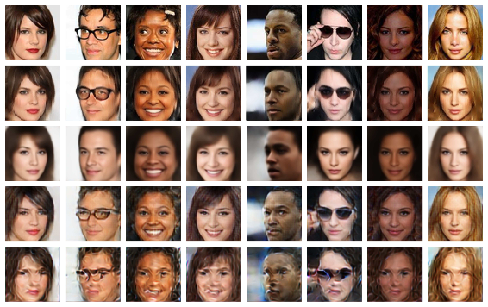

# A fast and memory efficient perceptual similarity metric for deep neural networks based on ideas from psychophysical research

Steffen Czolbe, 2019



This repository contains the similarity metrics designed and tested in the thesis, as well as implementations of experiments. Implementation in the deep-learning framework PyTorch. Code intended to be reuseable is in neatly organized python files. Code not intended to be reuseable is implemented in jupyter notebooks.

## Using the similarity metrics

We implemented a ``LossProvider`` to easily make all pre-trained similarity metrics accessible. The provided code snipped imports the pre-trained Watson-fft metric for datasets with 3 channels. 
```python
from loss.loss_provider import LossProvider

provider = LossProvider()
loss_function = provider.get_loss_function('Watson-fft', 'RGB', reduction='sum')
```

You can further specify the returned loss function by changing the parameters:

* The first parameter defines the loss metric. Implemented metrics are ``'L1', 'L2', 'SSIM', 'Watson-dct', 'Watson-fft', 'Watson-vgg', 'Deeploss-vgg'``. 
* The second parameter defines the color representation. Default is the three-channel ``'RGB'`` model. Mono-channel Grey-scale representation can be used py passing ``'LA'``. 
* Keyword argument ``reduction``, with behaviour according to PyTorch guideline. Default value is ``reduction='sum'``. All metrics further support option ``reduction='none'``.
* Keyword argument ``deterministic``. Determines the shifting behaviour of metrics ``'Watson-dct'`` and ``'Watson-fft'``. The shifts make the metric non-deterministic, but lead to faster convergence and better results. Though in some cases we might prefer a deterministic behaviour. Default ``deterministic=False``.

## Training generative models with the metrics
The experiments from the Thesis are implemented in directory ``src/vae``. They provide an example of how to train a VAE with the supplied similarity metrics.

## Datasets
Download scripts for the MNIST and celebA datasets are supplied in the ``src/datasets`` directory.

## Re-runnng Experiments
TBA.

